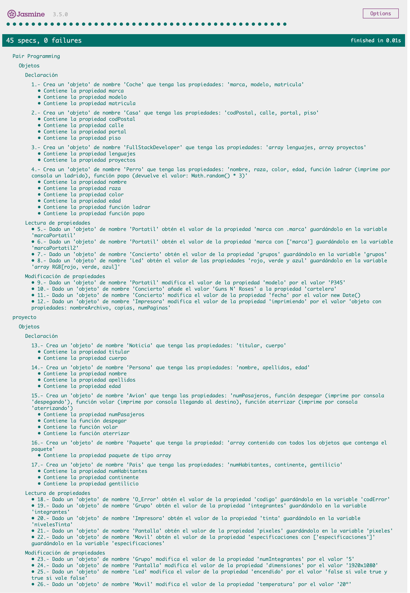

# :european_castle: :crossed_swords: Bikram #

## Introducción ##
Un bikram es una combinación de 26 ejercicios de programación para perfeccionar la conexión entre el programador interior que llevas dentro y el alma del lenguaje de programación. Aprovecha los checkboxes en el enunciado para ir marcando que ejercicios llevas realizados.

Estas 26 pruebas cubren un espectro de dificultad incremental, dotada de tests que cubrirán la correcta resolución para ayudarte a encontrar posibles errores en tu código.

La soluciones a los bikrams deberán hacerse en **./index.js** y tienen que subirse a GitHub, además, deberá incluirse una captura de pantalla de los tests.

En esta ocasión, el bikram se dividirá en :crossed_swords: Pair Programming :crossed_swords: y :european_castle: proyecto individual :european_castle:

## Iteraciones :crossed_swords: Pair Programming :crossed_swords: ##

### Objetos ###

#### Declaración ####

- [ ] 1.- Crea un **objeto** de nombre **Coche** que tenga las propiedades: **marca, modelo, matricula**

- [ ] 2.- Crea un **objeto** de nombre **Casa** que tenga las propiedades: **codPostal, calle, portal, piso**

- [ ] 3.- Crea un **objeto** de nombre **FullStackDeveloper** que tenga las propiedades: **array lenguajes, array proyectos**

- [ ] 4.- Crea un **objeto** de nombre **Perro** que tenga las propiedades: **nombre, raza, color, edad, función ladrar (imprime por consola un ladrido), función popo (devuelve el valor: Math.random() * 3)**

#### Lectura de propiedades ####

- [ ] 5.- Dado un **objeto** de nombre **Portatil** obtén el valor de la propiedad **marca con .marca** guardándolo en la variable **marcaPortatil**

- [ ] 6.- Dado un **objeto** de nombre **Portatil** obtén el valor de la propiedad **marca con ["marca"]** guardándolo en la variable **marcaPortatil2**

- [ ] 7.- Dado un **objeto** de nombre **Concierto** obtén el valor de la propiedad **array grupos** guardándolo en la variable **grupos**

- [ ] 8.- Dado un **objeto** de nombre **Led** obtén el valor de las propiedades **rojo, verde y azul** guardándolo en la variable **array RGB[Rojo, Verde, Azul]**

#### Modificación de propiedades ####

- [ ] 9.- Dado un **objeto** de nombre **Portatil** modifica el valor de la propiedad **modelo** por el valor **P345**

- [ ] 10.- Dado un **objeto** de nombre **Concierto** añade el valor **Guns N' Roses** a la propiedad **cartelera**

- [ ] 11.- Dado un **objeto** de nombre **Concierto** modifica el valor de la propiedad **fecha** por el valor **new Date() (fecha de hoy)**

- [ ] 12.- Dado un **objeto** de nombre **Impresora** modifica el valor de la propiedad **imprimiendo** por el valor **objeto con propiedades: nombreArchivo, copias, numPaginas**

## Iteraciones :crossed_swords: Pair Programming :crossed_swords: ##

### Objetos ###

#### Declaración ####

- [ ] 13.- Crea un **objeto** de nombre **Noticia** que tenga las propiedades: **titular, cuerpo**

- [ ] 14.- Crea un **objeto** de nombre **Persona** que tenga las propiedades: **nombre, apellidos, edad**

- [ ] 15.- Crea un **objeto** de nombre **Avion** que tenga las propiedades: **numPasajeros, función despegar (imprime por consola 'despegando'), función volar (imprime por consola llegando al destino), función aterrizar (imprime por consola 'aterrizando'**

- [ ] 16.- Crea un **objeto** de nombre **Paquete** que tenga las propiedades: **array contenido con todos los objetos que contenga el paquete**

- [ ] 17.- Crea un **objeto** de nombre **Pais** que tenga las propiedades: **numHabitantes, continente, gentilicio**

#### Lectura de propiedades ####

- [ ] 18.- Dado un **objeto** de nombre **O_Error** obtén el valor de la propiedad **codigo** guardándolo en la variable **codError**

- [ ] 19.- Dado un **objeto** de nombre **Grupo** obtén el valor de la propiedad **array integrantes** guardándolo en la variable **integrantes**

- [ ] 20.- Dado un **objeto** de nombre **Impresora** obtén el valor de la propiedad **objeto tinta{rojo, verde, azul}** guardándolo en la variable **nivelesTinta**

- [ ] 21.- Dado un **objeto** de nombre **Pantalla** obtén el valor de la propiedad **array bidimensional pixeles** guardándolo en la variable **pixeles**

- [ ] 22.- Dado un **objeto** de nombre **Movil** obtén el valor de la propiedad **especificaciones con ["especificaciones"]** guardándolo en la variable **especificaciones**

#### Modificación de propiedades ####

- [ ] 23.- Dado un **objeto** de nombre **Grupo** modifica el valor de la propiedad **numIntegrantes** por el valor **5**

- [ ] 24.- Dado un **objeto** de nombre **Pantalla** modifica el valor de la propiedad **dimensiones** por el valor **1920x1080**

- [ ] 25.- Dado un **objeto** de nombre **Led** modifica el valor de la propiedad **encendido** por el valor **false si vale true y true si vale false**

- [ ] 26.- Dado un **objeto** de nombre **Movil** modifica el valor de la propiedad **temperatura** por el valor **20º**

-----

Dev1 = Santy Orozco 🧪

Dev2 = Egoitz Aulestia 🚀

